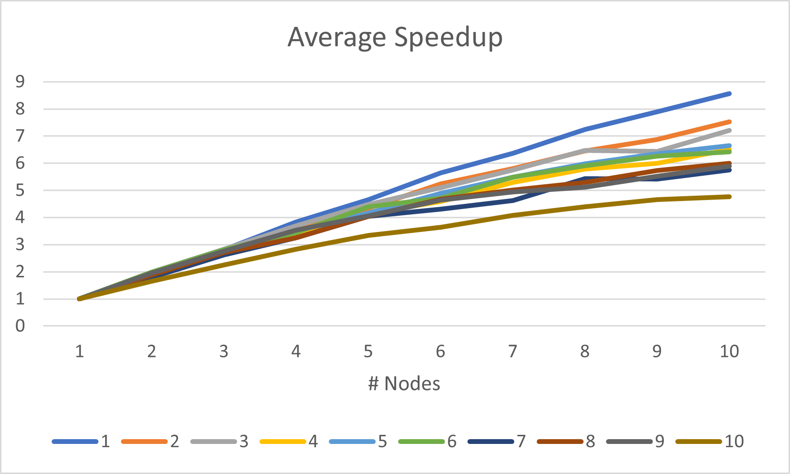
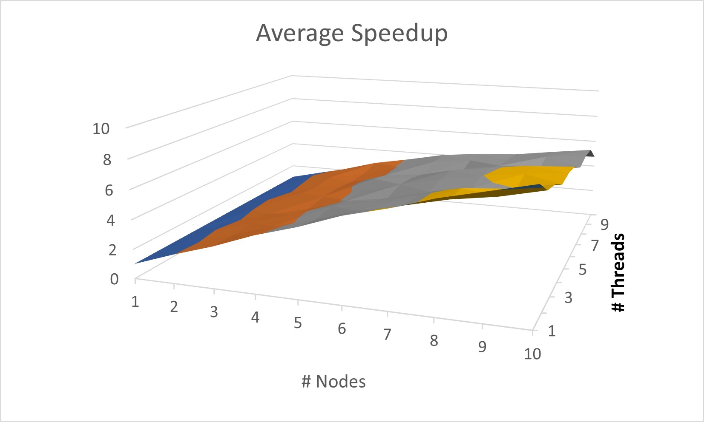
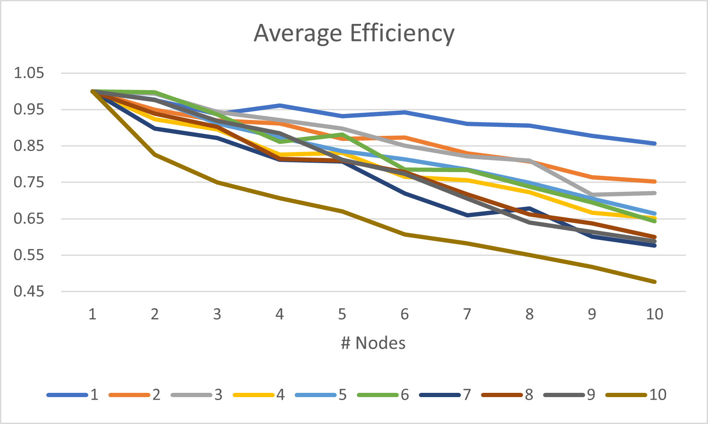
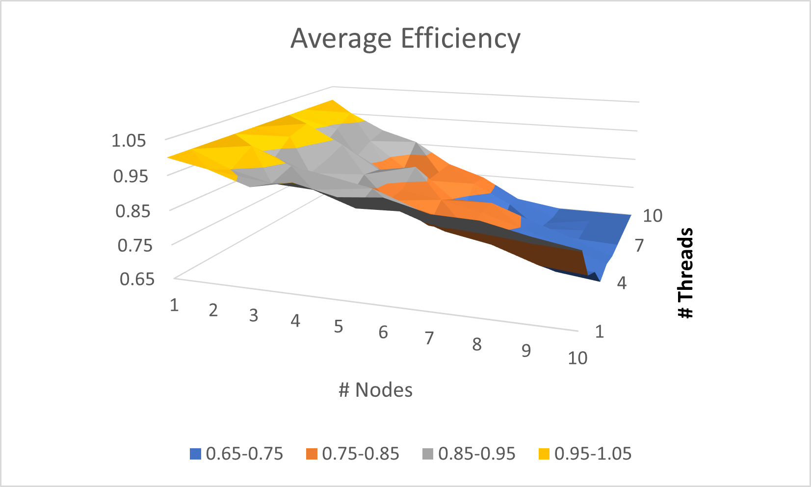
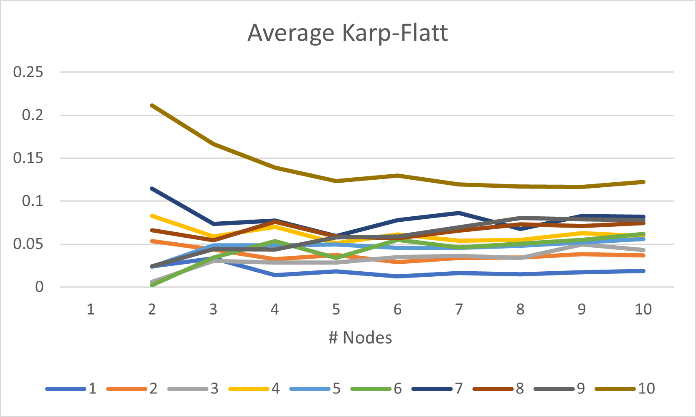
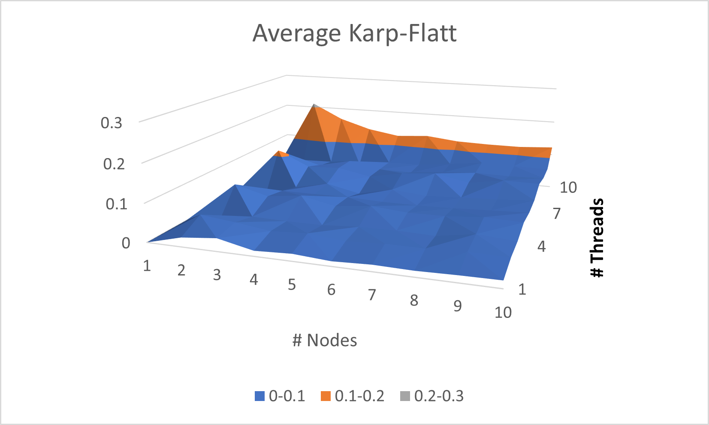

**Summary:** Within this assignment we explored and applied the knowledge of openmp and mpi we had learned up to this point. This included many different functions and methods for parallelizing our program to achieve the best stats in speedup, efficiency, and Karp-Flatt. The program we were operating on runs the PSO algorithm, particle swarm optimization. This algorithm attempts to find the maximum by moving many different particles around constantly based on feedback they receive. We used our knowledge of both mpi and openmp as well as the two previous assignments we had worked on using this algorithm to combine our knowledge and parallelize the algorithm further by using both together.

**Instructions:** To run this code you will need to do so on OSC by using the provided jobScript.slurm. To make changes to the algorithm for testing you will want to alter ./src/main.cpp and alter Np which is population size of the particles seeking out the highest point, Nd which is the number of present dimensions, Nt which is the number of iterations it undergoes to find the best point from all iterations, and lastly the number of trials which determines how many times each combination is run in the program, which I set at 5. On OSC you will want to set your directory to Default and run 'make clean' and then 'make OSC'. Lastly you will want to go up one directory from Default and run sbatch jobScript.slurm to run the program.

**Algorithm:** The PSO algorithm is run to find the peak of all points in a function by sending out a desired number of particles who take active feedback and move around the function accordingly until they return with their best possible answer. This function can be fine tuned to the point that it continually gives a better answer, but this would require many resources. For our PSO function we attempted to get as best results as we could without using days worth of resources. To start off we take a number of particles, Np, and we uniformly distribute them in a vector before updating the best known position and initializng velocity. Then while we remain below the number of iterations, Nt, we continue through a loop that uses dimensions and random numbers to update positions and velocities of the particles individually while also constantly updating the best known position for the individual particle as well as the entire swarm as the search continues, before finally returning the best position that was found overall. The higher we increase our number of particles and iterations, the better, more accurate data we can expect to receive as an output but in return we will experience a longer time for the algorithm to complete.

**Method:** The only part of the code that was edited for parallelization was within the function PSO(). As for OpenMP, I tried to add as many #pragma omp parallel sections to portions of the code that could take advantage of the multiple threads available. At one point I experimented with sections briefly, but my performance remained the best while using the parallel for loops. While parallelizing the code I had to pay special attention to variables that were private or that could take advantage of the reduction clause to avoid using atomic/critical sections. I also took advantage of the collapse() statement with my loops to allow nested parallelism for two of the nested for loops. My strategy for approaching this assignment was to stick with what I am comfortable with and then try to implement more of what we learned in class. The issue I encountered was working on code that wasn't mine and trying to figure out exactly how everything performed. I struggled to figure out which variables were being used in certain ways and this in turn made it hard to know which variables were shared, required to be private, or that could take advantage of the reduction clause. I also encountered the issue that once I added for the most part solely parallel for loops, I couldn't get proper performance with other methods of parallelization and ended up having to try to work with those to the best of my ability. As for MPI, I used derived data types for Particle and Swarm to be able to use them in parallelized MPI code. I then created the swarms of particles and used scatter and gather to divide them amongst the nodes available before bringing them back together. Within this MPI parallelization is where the OpenMp parallelization took place. Issues I ran into using MPI were incorrect use of Np vs my variable num which was how many particles were in each node. I was using Np which created a segmentation fault since the code was reaching beyond the number of particles available per node. My other issue I ran into was getting MPI_Allreduce(). I was attempting to use this to bring together the amount of evaluations between all of the nodes but unfortunately I was unable to get this code working as it was erroring out with the MPI_INIT and MPI_COMM_WORLD. I ended up moving on from this after a good amount of time so all of my numEvals are showing up as the true value divided by the number of nodes. Overall I feel like I was able to parallelize this algorithm well and the growth from the class is evident in the results I achieved.

**Discussion & Analysis:** All results are available in both a [CSV](https://gitlab.com/kodywilliamson/cs4170_sp2021_a03_williamson/-/blob/master/openmp-mpi-hybrid/Default/results.csv) and [Excel](https://gitlab.com/kodywilliamson/cs4170_sp2021_a03_williamson/-/blob/master/openmp-mpi-hybrid/Results/results.xlsx) format. Evaluation was done using the average of 5 trials between the combination of 1-10 nodes and 1-10 threads per node with a population size(Np) of 1000.
The results I received showed a linear speedup upwards as the number of threads increases and shows little variance between the different number of threads per node. Since there is little effect from the threads per node we can assume this problem scales well with increasing population sizes and would not be affected much by large problem sizes. With the linear increasing speedup we can also assume that the speedup will continue to increase as nodes are added beyond what we tested. We see that the number of threads per nodes has less speedup the more threads that are added per node. This means that we can assume large thread numbers per node will trend downwards in speedup per node added.
The efficiency of the PSO parallelized is declining linearly as the number of nodes continues to increase and shows little variance between the different population sizes. This means that as we continue to use more resources on this algorithm in its current state, we can expect to get less speedup out of each node added although it continues to increase speedup. As for the threads per node we see that slightly lower efficiency with each thread per node added so we can assume each thread per node added will have a positive efficiency but will add less and less efficiency with each one added per node.
The Karp-Flatt metric shows an initial spike at the higher nodes but shows a linear and flat pattern beyond 3 nodes as nodes are added. The threads per node tend to follow a similar pattern but the three highest problem sizes have the highest Karp-Flatt metric by 10 threads. The line is somewhat flat and might have just had an original spike in data that might not repeat on further testing but I cannot say with confidence that this problem scales well with problem size using this graph.

