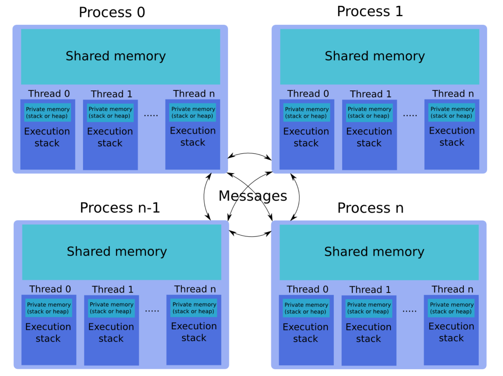
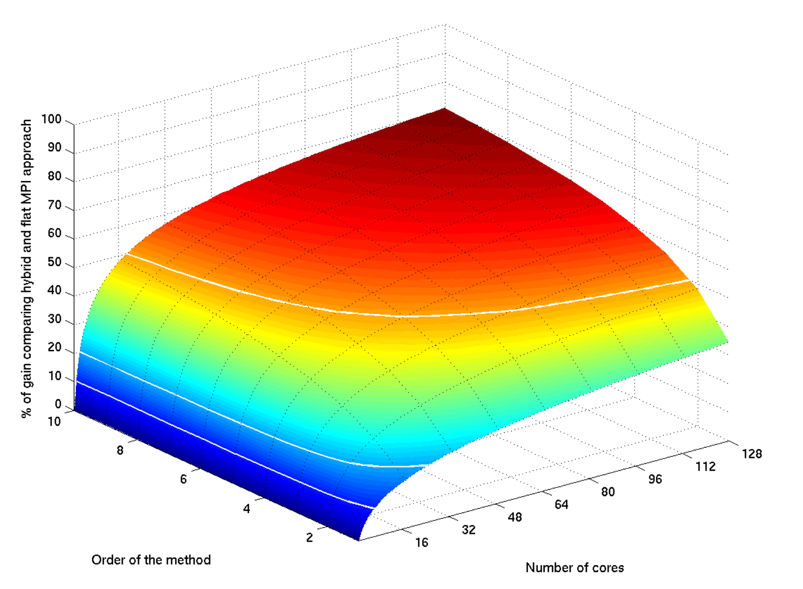

# Notes for Hybrid Programming 
(Most taken from http://www.idris.fr/media/eng/formations/hybride/hybride_v3-1_en.pdf)

## Reasons for Hybrid Programming
## Advantages of Hybrid Code
1. **Improved scalability** 
    - Reduces number of MPI messages
    - Reduces number of process involved in collective communications
    - Improves load balancing
    - Improves granularity
    - May reduce number of MPI processes needed
    - Fewer simultaneous accesses in I/O
    
2. **Better fit for modern architectures**
    - Distributed Shared Memory.
    - Certain architectures require executing several threads (or processes) per core in order to efficiently use the computational units.

3. **Optimizes memory consumption.**
    - Less replicated data in the MPI processes
    - Less memory used by the MPI library itself.

## Disadvantages
1. Complexity and higher level of expertise.
2. Necessity of having good MPI and OpenMP performances (Amdahl’s law applies separately to the two approaches).
3. Total gains in performance are not guaranteed (extra additional costs, ...).

## Applications that Benefit
1. Codes having limited MPI scalability (due to using calls to MPI_Alltoall, for example)
2. Codes requiring dynamic load balancingCodes limited by memory size and having a large amount of replicated data in the MPI process or having data structures which depend on the number of processes for their dimension
3. Inefficient local MPI implementation library for intra-node communications
4. Many massively parallel applications
5. Codes working on problems of fine-grain parallelism or on a mixture of fine-grainand coarse-grain parallelism
6. Codes limited by the scalability of their algorithms
7. ...
## Steps to Create Hybrid Code
1. Create optimized and validated OpenMP Implementation
2. Create optimized and validated MPI Implementation
3. Create/Combine/Merge optimized and validated Hybrid Implementation

## Main Programming Items

### Main Functions Called
- `int MPI_Init_thread(int& argc, char**& argv, int required)` initializes with threading support.
- `int MPI_Init_thread(int required)` initializes with threading support.
- `MPI_Query_thread(int *provided)` returns the support level of the calling process.
- `MPI_Is_thread_main(int *flag)` tells you if this is the main, calling thread.

### Threading Levels 
- `MPI_THREAD_SINGLE`: One thread per process (No OpenMP)
- `MPI_THREAD_FUNNELED`: Several threads per process, but only main thread can make MPI Calls (MPI calls outside of parallel regions, or by main thread)
- `MPI_THREAD_SERIALIZED`: All threads can make MPI calls, just one at a time (MPI Calls must be made in critical sections)
- `MPI_THREAD_MULTIPLE`: Entirely multi-threaded w/o restrictions (No restrictions)

### Restrictions
- It is forbidden, therefore, to have several threads per process making calls with the same communicator without first ensuring that these calls are made in the same order on each of the processes.
- We cannot have at any given time, therefore, more than one thread making a collective call with the same communicator (whether the calls are different or not).
- For example, if several threads make a call to `MPI_Barrier` with `MPI_COMM_WORLD`, the application may hang
- 2 threads, each one calling an `MPI_Allreduce` (with the same reduction operation or not), could obtain false results.
- 2 different collective calls cannot be used either (for example, an `MPI_Reduce` and an `MPI_Bcast` )
## Other Notes
- For OpenMPI use `--enable-mpi-threads` with compiler
- For Intel use `-mt_mpi` with compiler
- `Finalize` must be called by the same thread that called `Init`
